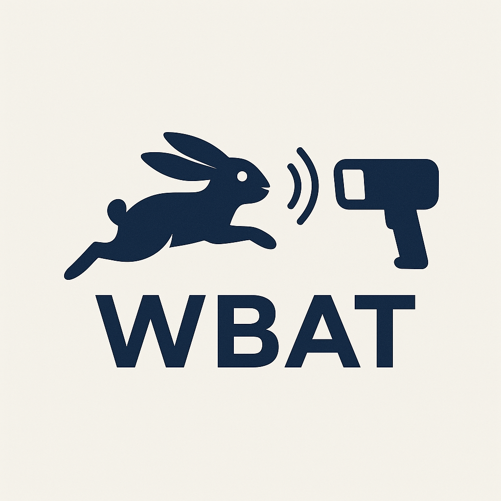

web-based-auditory-toolbox (WBAT) is a package of tools for conducting auditory experiments in a web browser. Web technologies change too fast for researchers to trust claims. With WBAT, instead of relying on performance claims, you have the tools to measure for yourself.

## Repository layout

- `packages/wbat`: Core library (AuditoryToolbox)
- `packages/recorder-worklet`: AudioWorklet recorder module
- `packages/test-server`: Example jsPsych server + storage
- `tests/`: Jest client-side unit tests

## Features

### AudioWorklet recorder

Audio can be recorded using a WebAudio AudioWorklet.

### Virtual loopback

Record stimulus and response in the same AudioContext. If participants are not required to wear headphones, precisely epoch trial onsets by aligning features of the stimulus in the response signal.

### Remote Latency Measurement

Robust round-trip-latency (RTL) measurement. For experiments were participants *are* required to wear headphones, `latencyTest` blocks allow real-time, high-precision measurement of RTL.

### AV Sync (Beta)

We are testing methods for precisely measuring (and correcting) asynchrony between presentation of audio and visual stimuli.

## Deployment support

Not a developer, but want to try the tools out? Get in touch to let us know how we can help.

## Usage

For minimal examples of the core methods, see `packages/wbat/README.md`.

## Build

This guide assumes that you have Node.js and npm installed on your system.

### Step 1: Clone the repository

Clone the repository to your local machine using:

```sh
git clone https://github.com/abeith/web-based-auditory-toolbox.git
cd web-based-auditory-toolbox
```

### Step 2: Install dependencies

Install all necessary dependencies to build the project:

```sh
npm install
```

### Step 3: Build the project

Compile the TypeScript files to JavaScript:

```sh
npm run build
```

This command builds each workspace package and writes outputs to each package's `dist/` directory.

## Test server

This project includes a test server that shows how WBAT can be used in a jsPsych experiment to collect data. You can run the test server with:

```sh
npm run start
```

Then visit http://localhost:3000/jspsych in your browser.
